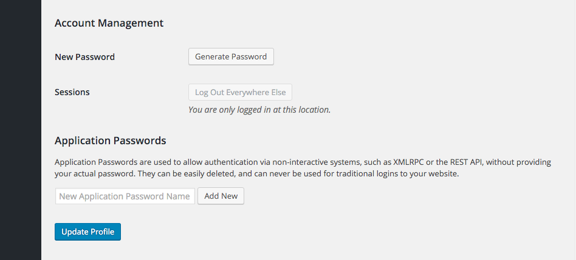

<!-- DO NOT EDIT THIS FILE; it is auto-generated from readme.txt -->
# My version 2

To better understand how it works I am playing around with this plugin.  It is changed to now only allow application passwords and to throw an error on any other attempt to access.

## Notes/Learning

* On the dreamhost VPS the basic authentication header is not being passed thru to wordpress by default so by default $_SERVER['PHP_AUTH_USER'] is never set and thus authentication never takes place
* `SetEnvIf Authorization "(.*)" HTTP_AUTHORIZATION=$1` seems to fix the above issue
* The original plug, is designed to allow multiple authentication methods.  So if no authentication is tried the REST API still works.
* The authenticate filter does not seem to be ever called.
* determine_current_user filter is called on every page
* rest_authentication_errors filter is only called on REST API requests
* [This change](https://github.com/georgestephanis/application-passwords/pull/47/files) is the direction I went and added a trigger on filter rest_authentication_errors 
* [This idea](https://github.com/WP-API/Basic-Auth/pull/13/commits/ea1efb8d02d41c4a11e156680127c635e75f3a0f) looks interesting however I did not actually test it - I went with the first 2 points instead
* [This idea](https://github.com/WP-API/Basic-Auth/pull/32/files) also looks good but it does not work on its own, I added with point 1 and 2 to be safe

## ToDo

1. change the authentication error so that the no authentication and wrong password have the same error message
1. remove debug output

Everything below is from the original plugin which can be found at:

[https://github.com/georgestephanis/application-passwords](https://github.com/georgestephanis/application-passwords)

# Application Passwords

A feature plugin for core to provide Application Passwords

**Contributors:** [georgestephanis](https://profiles.wordpress.org/georgestephanis), [valendesigns](https://profiles.wordpress.org/valendesigns), [kraftbj](https://profiles.wordpress.org/kraftbj)  
**Tags:** [application-passwords](https://wordpress.org/plugins/tags/application-passwords), [rest api](https://wordpress.org/plugins/tags/rest api), [xml-rpc](https://wordpress.org/plugins/tags/xml-rpc), [security](https://wordpress.org/plugins/tags/security), [authentication](https://wordpress.org/plugins/tags/authentication)  
**Requires at least:** 4.4  
**Tested up to:** 4.5  
**Stable tag:** trunk (master)  
**License:** [GPLv2 or later](http://www.gnu.org/licenses/gpl-2.0.html)  


## Description ##

This is a feature plugin that is a spinoff of the main Two-Factor Authentication plugin, found at https://github.com/georgestephanis/two-factor/.

With Application Passwords you are able to authenticate a user without providing that user's password directly, instead you will use a base64 encoded string of their username and a new application password.

## Installation ##

1. Download the zip file.
2. Log into WordPress, hover over *Plugins*, and click *Add New*.
3. Click on the *Upload Plugin* button.
4. Select the zip file you downloaded.
5. Click *Install Plugin*.
6. Activate.

## Screenshots ##

### In your user profile screen, by default it will just be a field to create a new Application Password.



### After at least one Application Password for you account exists, you'll see a table displaying them, allowing you to view usage and revoke them as desired.


## Creating a New Application Password ##

1. Go the User Profile page of the user that you want to generate a new application password for.  To do so, click *Users* on the left side of the WordPress admin, then click on the user that you want to manage.
2. Scroll down until you see the Application Passwords section.  This is typically at the bottom of the page.
3. Within the input field, type in a name for your new application password, then click *Add New*.
   **Note:** The application password name is only used to describe your password for easy management later.  It will not affect your password in any way.  Be descriptive, as it will lead to easier management if you ever need to change it later.
4. Once the *Add New* button is clicked, your new application password will appear.  Be sure to keep this somewhere safe, as it will not be displayed to you again.  If you lose this password, it cannot be obtained again.

## Testing an Application Password ##

### WordPress REST API

This test uses the technologies listed below, but you can use any REST API request.

* WordPress REST API
* cURL
* Mac OSX or Linux
* A Mac or Linux terminal
* Local development environment (e.g. MAMP, XAMPP, DesktopServer, Vagrant) running on localhost

1. Now that you have your new password, you will need to base64 encode it using a terminal window as well as your username to use it with the REST API.
   The command you will use is as follows:
```shell
echo -n "USERNAME:PASSWORD" | base64
```
   Within this, you will replace *USERNAME:PASSWORD* with your username and newly generated application password.  For example:
```shell
echo -n "admin:mypassword123" | base64
```

2. Once your username and password are base64 encoded, you are now able to make a simple REST API call using the terminal window to update a post.  Because you are performing a POST request, you will need to authorize the request using your newly created base64 encoded access token. If authorized correctly, you will see the post title update to "New Title."
```shell
curl --header "Authorization: Basic ACCESS_TOKEN" -X POST -d "title=New Title" http://LOCALHOST/wp-json/wp/v2/posts/POST_ID}
```
   When running this command, be sure to replace *ACCESS_TOKEN* with your newly generated access token, *LOCALHOST* with the location of your local WordPress installation, and *POST_ID* with the ID of the post that you want to edit.

### XML-RPC

This test uses the technologies listed below, but you can use any XML-RPC request.

* XML-RPC enabled within WordPress
* cURL
* Mac OSX or Linux
* A Mac or Linux terminal
* Local development environment (e.g. MAMP, DesktopServer, Vagrant) running on localhost

Once you have created a new application password, it's time to send a request to test it.  Unlike the WordPress REST API, XML-RPC does not require your username and password to be base64 encoded.  To begin the process, open a terminal window and enter the following:
```shell
curl -H 'Content-Type: text/xml' -d '<methodCall><methodName>wp.getUsers</methodName><params><param><value>1</value></param><param><value>USERNAME</value></param><param><value>PASSWORD</value></param></params></methodCall>' LOCALHOST
```
In the above example, replace *USERNAME* with your username, and *PASSWORD* with your new application password.  This should output a response containing all users on your site.

